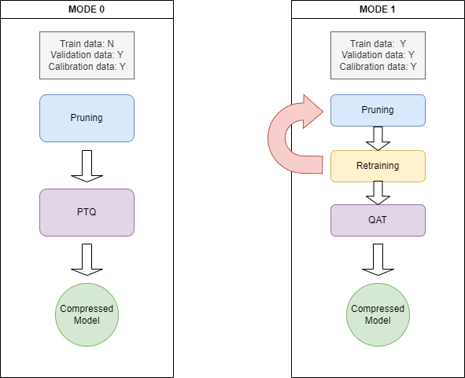

# AI_Compressor

Neural Network Compressor with Pruning, Knowledge Distillation, and Quantization.

## Overview
AI_Compressor is a tool for compressing neural network models using various techniques, including pruning, knowledge distillation (KD), and quantization. It provides two modes of operation to accommodate different use cases, whether training data is available or not.

### Modes of Operation
- **Mode 0 (Post-training Setting)**: For scenarios where training data is not available and retraining is not feasible. Requires only a calibration dataset to achieve compression.
- **Mode 1 (Training Available)**: Designed for scenarios where training data is available, allowing further model optimization through knowledge distillation and quantization-aware training (QAT).



## How to Run
To run the compressor, follow these steps:

1. Clone the repository:
   ```sh
   git clone https://github.com/bok3948/AI_Compressor.git
   cd AI_Compressor
   ```

2. Install the necessary dependencies:
   ```sh
   pip install -r requirements.txt
   ```

3. Run the compressor :
   ```sh
   python main.py --device cuda --mode 1 --data-set CIFAR --data_path ./ --model mobilenetv2_x1_0 --pretrained ./cifar100_mobilenetv2_x1_0.pt 
   ```
   #available model list: resnet, deit(from timm), mobilenetv2 (other model may be not compatible with this code) Most of CNN model is okay but transoformer need to change forward function 

## Results
The compressor has been tested with various models, including MobileNetV2, ResNet18, and DeiT. The results demonstrate a trade-off between latency, size, and accuracy.


## Reproduce
- DownLoad Trained Model here [Google Drive Link](https://drive.google.com/file/d/1OmCzW_q9zCORb38RHm528-AKhN86Zeli/view?usp=drive_link)
- To run MobileNetV2 compression mode:
  ```sh
  python main.py --device cuda --mode 1 --data-set CIFAR --data_path ./ --model mobilenetv2_x1_0 --pretrained ./cifar100_mobilenetv2_x1_0.pt --pruning_ratio 0.6 --total_iters 5 --global_pruning --weight_decay 0.05 --lr 1e-5 --qat_lr 1e-5 --qat_epochs 10 --epochs 100 --do_KD
  ```

  ## MobileNetv2 Result
| Model Name                     | Top-1 Accuracy (%) | Top-5 Accuracy (%) | Latency (ms) | Model Size (MB) |
|--------------------------------|--------------------|--------------------|--------------|-----------------|
| ONNX Mobilenetv2 Compressed    | 73.27              | 92.38              | 0.9013       | 1.37            |
| Torch Mobilenetv2 Pruned       | 73.83              | 92.69              | 3.5839       | 4.70            |
| Torch Mobilenetv2 Original     | 73.51              | 92.38              | 5.1606       | 9.63            |


  


