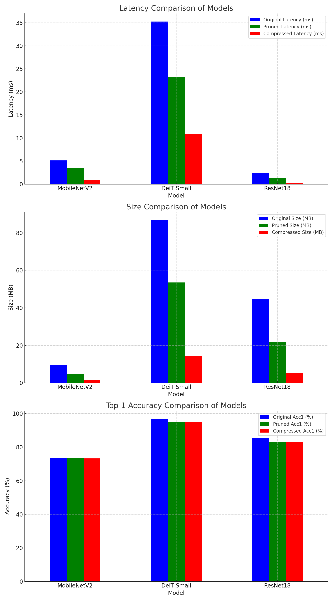

# AI_Compressor

Neural Network Compressor with Pruning, Knowledge Distillation, and Quantization.

## Overview
AI_Compressor is a tool for compressing neural network models using various techniques, including pruning, knowledge distillation (KD), and quantization. It provides two modes of operation to accommodate different use cases, whether training data is available or not.

### Modes of Operation
- **Mode 0 (Post-training Setting)**: For scenarios where training data is not available and retraining is not feasible. Requires only a calibration dataset to achieve compression.
- **Mode 1 (Training Available)**: Designed for scenarios where training data is available, allowing further model optimization through knowledge distillation and quantization-aware training (QAT).


## How to Run
To run the compressor, follow these steps:

1. Clone the repository:
   ```sh
   git clone https://github.com/yourusername/AI_Compressor.git
   cd AI_Compressor
   ```

2. Install the necessary dependencies:
   ```sh
   pip install -r requirements.txt
   ```

3. Run the compressor in your desired mode:
   ```sh
   python compressor.py --mode [0 or 1] --model [MODEL_NAME] --data [DATA_PATH] 
   ```
   - **mode**: Choose either `0` or `1` depending on the availability of training data.
   - **model**: Specify the model to be compressed (e.g., MobileNetV2, ResNet18, DeiT).
   - **data**: Provide the path to the dataset (required for Mode 1).

## Results
The compressor has been tested with various models, including MobileNetV2, ResNet18, and DeiT. The results demonstrate a trade-off between latency, size, and accuracy.


## Reproduce
- DownLoad Trained Model here [Google Drive Link](https://drive.google.com/file/d/1OmCzW_q9zCORb38RHm528-AKhN86Zeli/view?usp=drive_link)
- To run MobileNetV2 compression mode:
  ```sh
  python compressor.py --mode 1 --data_set CIFAR --data_path ./ --model mobilenetv2_x1_0 --pretrained ./cifar100_mobilenetv2_x1_0 --pruning_ratio 0.6 --global_pruning True --weight_decay 0.0005 --lr 1e-6 --qat_lr 1e-6 --qat_epochs 10 --epochs 100 --do_KD
  ```


# AI_Compressor

Neural Network Compressor with Pruning, Knowledge Distillation, and Quantization.

## Overview
AI_Compressor is a tool for compressing neural network models using various techniques, including pruning, knowledge distillation (KD), and quantization. It provides two modes of operation to accommodate different use cases, whether training data is available or not.

### Modes of Operation
- **Mode 0 (Post-training Setting)**: For scenarios where training data is not available and retraining is not feasible. Requires only a calibration dataset to achieve compression.
- **Mode 1 (Training Available)**: Designed for scenarios where training data is available, allowing further model optimization through knowledge distillation and quantization-aware training (QAT).


## How to Run
To run the compressor, follow these steps:

1. Clone the repository:
   ```sh
   git clone https://github.com/[YOUR_USERNAME]/AI_Compressor.git
   cd AI_Compressor
   ```

2. Install the necessary dependencies:
   ```sh
   pip install -r requirements.txt
   ```

3. Run the compressor in your desired mode:
   ```sh
   python compressor.py --mode [0 or 1] --model [MODEL_NAME] --data [DATA_PATH]
   ```
   - **mode**: Choose either `0` or `1` depending on the availability of training data.
   - **model**: Specify the model to be compressed (e.g., MobileNetV2, ResNet18, DeiT).
   - **data**: Provide the path to the dataset (required for Mode 1).

## Results
The compressor has been tested with various models, including MobileNetV2, ResNet18, and DeiT. The results demonstrate a trade-off between latency, size, and accuracy.



## Reproduce
To reproduce the results, download the trained models and follow the instructions below:

- **Download Trained Model**: [Google Drive Link](https://drive.google.com/file/d/1OmCzW_q9zCORb38RHm528-AKhN86Zeli/view?usp=drive_link)

- To run MobileNetV2 compression in mode 1:
  ```sh
  python compressor.py --mode 1 --data_set CIFAR --data_path ./ --model mobilenetv2_x1_0 --pretrained ./cifar100_mobilenetv2_x1_0 --pruning_ratio 0.6 --global_pruning True --weight_decay 0.0005 --lr 1e-6 --qat_lr 1e-6 --qat_epochs 10 --epochs 100 --do_KD
  ```

## Features
- **Pruning**: Remove unnecessary connections in the neural network to reduce model size and latency.
- **Knowledge Distillation (KD)**: Use a teacher-student framework to improve model accuracy while reducing size.
- **Quantization (PTQ/QAT)**: Convert model parameters to lower precision to further decrease memory and computational requirements.

## Examples
- To run MobileNetV2 compression in post-training mode:
  ```sh
  python compressor.py --mode 0 --model MobileNetV2 --data ./data/calibration
  ```
- To run DeiT compression with training:
  ```sh
  python compressor.py --mode 1 --model DeiT --data ./data/train
  ```

## License
This project is licensed under the MIT License. See the [LICENSE](./LICENSE) file for more information.

## Contributing
Contributions are welcome! Please create a pull request or open an issue if you have suggestions or bug reports.

## Contact
For questions or support, please contact [YOUR_EMAIL].


